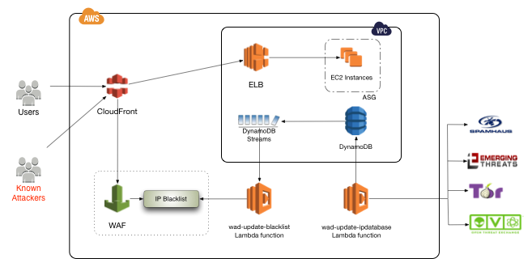

waf-update-ipdatabase
=====================

AWS Lambda function that creates and updates a DynamoDB database with a list of blacklisted IP addresses from the following public RBLs -
* Alienvault OTX
* Tor Exit Nodes

## Design
AWS Web Application Firewall (WAF) filters web traffic before it hits the origin. WAF is a managed service that is deployed outside the VPC. So, it is a logical place to verify requests before they reach the VPC.

Several security focussed organizations publish reputation lists with IP addresses of bad actors. Some popular ones are
* [Alienvault Open Threat Exchange (OTX)](https://www.alienvault.com/open-threat-exchange)
* [Tor exit node list](https://check.torproject.org/exit-addresses)
* [Spamhaus Don't Route Or Peer (DROP) and Extended DROP (EDROP)](https://www.spamhaus.org/drop/drop.txt)
* [Emerging Threats IP list](https://rules.emergingthreats.net/fwrules/emerging-Block-IPs.txt)

An aggregated collection of bad IP addresses is maintained in a DynamoDB database that is updated frequently using this utility. [DynamoDB Streams](http://docs.aws.amazon.com/amazondynamodb/latest/developerguide/Streams.html) are enabled on the table to trigger the `waf-update-blackist` Lambda function to update the IP blacklist with any changes to the DynamoDB table.



`NOTE:` A decoupled design is implemented to enable support for other web application firewalls. For example, updating an blacklisted IPs data group in F5 load balancer; or, [update the banned IPs list in Brocade's Virtual Traffic Manager](https://github.com/hcentive/brocade-update-firewall).

## Configuration and Installation
The plugin is implemented in [Node.js](https://nodejs.org/en/). The following components are required to run this plugin -
* git
* nodejs (6.10)

Check out the repository from git -
```
$ git clone https://github.com/hcentive/waf-update-ipdatabase
```
Go to the `waf-update-ipdatabase` directory. Rename `alienvault.json.template` to `alienvault.json`.
```
$ cd waf-update-ipdatabase
$ mv conf/alienvault.json.template conf/alienvault.json
```
Update configuration attributes with your [Alienvault OTX](https://www.alienvault.com/open-threat-exchange) API credentials. Replace `YOUR_API_KEY` with your OTX API key from Alienvault.
``` json
{
  "alientvaultRBL" : "https://otx.alienvault.com/api/v1/pulses/subscribed",
  "otx_host" : "otx.alienvault.com",
  "otx_api_key" : "YOUR_API_KEY",
  "otx_start_path" : "/api/v1/pulses/subscribed"
}
```
Create a [Lambda deployment package](http://docs.aws.amazon.com/lambda/latest/dg/nodejs-create-deployment-pkg.html) by zipping contents of the `waf-update-ipdatabase` directory into a single zip file
```
$ zip -r waf-update-ipdatabase.zip .
```
[Create the Lambda function](http://docs.aws.amazon.com/cli/latest/reference/lambda/create-function.html) using the CLI. An IAM role with permissions to create DynamoDB tables and insert/update/delete items is necessary to execute this Lambda function. Depending on the execution time and memory consumption, the `--timeout` and `--memory-size` parameters may need to be specified as well.
```
$ aws lambda create-function \
--region us-east-1 \
--function-name waf-update-ipdatabase \
--zip-file fileb://waf-update-ipdatabase.zip \
--role waf-update-ip-database-execution \
--runtime nodejs6.10 \
--handler export.handler
```
The Lambda function can be invoked manually to test it.
```
$ aws lambda invoke --function-name waf-update-ipdatabase result.txt
```
The function should be scheduled to update the database frequently.
